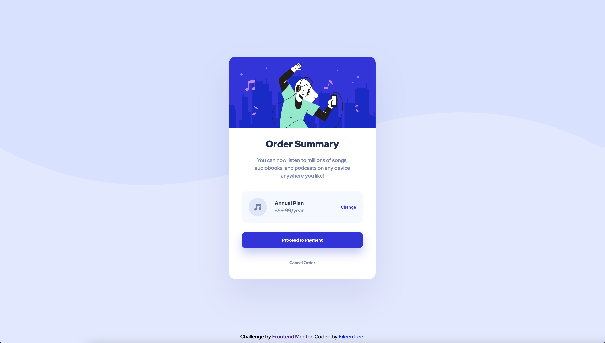

# Frontend Mentor - Order summary card solution

This is a solution to the [Order summary card challenge on Frontend Mentor](https://www.frontendmentor.io/challenges/order-summary-component-QlPmajDUj). Frontend Mentor challenges help you improve your coding skills by building realistic projects. 

## Table of contents

- [Overview](#overview)
  - [The challenge](#the-challenge)
  - [Screenshot](#screenshot)
  - [Links](#links)
- [My process](#my-process)
  - [Built with](#built-with)
  - [What I learned](#what-i-learned)
  - [Continued development](#continued-development)
  - [Useful resources](#useful-resources)
- [Author](#author)
- [Acknowledgments](#acknowledgments)

## Overview

Order summary card with HTML/CSS and hover state elements

### The challenge

Create an Order summary card that is both responsive and interactive.The card should have hover states for interactive elements.

### Screenshot



### Links

- Solution URL: [Github]()
- Live Site URL: [Live Site]()

## My process

I started with what I know about HTML and CSS, such as layouts, styles, and flexbox. For the components that I did not know how to style (such as background and buttons), I did some research online to find best methods.

### Built with

- Semantic HTML5 markup
- CSS custom properties
- Flexbox
- CSS Grid

### What I learned

I had a lot of new learnings in CSS. I became more confident with CSS flexbox, stumbling into less problems than before. I felt more confident with aligning and grouping elements, and using margin and padding. 

One valuable learning was justify-content. When I used this before, I did not understand why nothing changed - turns out that the elements are already filling in the gaps with max sizing. Once I specified certain widths and heights for elements inside divs, I was able to mess around with justify-content.

First, I tried out space-evenly, which spaced elements equally inside my div.

```css
.div {
  justify-content: space-evenly;
}
```

However, for this specific case, I wanted to move the plan information slightly closer to the music icon. I found that I could do space-between. I then used margin-left to shift the plan info to the left.

```css
.div {
  justify-content: space-between;
}
```

I also learned how to apply a background image, which is much easier than messing around with z-indexes with images. Background-size controls how much the images takes up the screen, and I prevented the image from repeating with background-repeat.

```css
html, body{
    background: url(images/pattern-background-desktop.svg);
    background-size: contain;
    background-repeat: no-repeat;
    background-color: hsl(225, 100%, 94%);
}
```

One last thing I learned was implementing hover states. I found that I can do this really easily in CSS by simply calling the element:hover. I changed color and text properties, as well as the cursor so that the cursor becomes a hand when hovering over the targeted element.

```css
h3:hover{
    color:hsl(241, 100%, 72%);
    text-decoration: none;
    cursor: pointer;
}
```


### Continued development

I would like to get more practice with interactive elements and hover states. I would also like to create events that happen when clicking on the hover element, such as going to a new page or creating a celebratory animation.

### Useful resources

- [Justify-content Demo](https://developer.mozilla.org/en-US/docs/Web/CSS/justify-content) - This gave me a good understanding of the different properties of justify-content.
- [CSS Box Shadow Examples](https://getcssscan.com/css-box-shadow-examples) - This page had examples of box shadows that I can copy then modify.
- [Full Page Background](https://www.w3schools.com/howto/howto_css_full_page.asp) - This article gives a great example of creating a full-height image in the background.

## Author

- Website - [Eileen Lee](https://eileenlee.me/)
- Frontend Mentor - [@bagelsbagel](https://www.frontendmentor.io/profile/bagelsbagel)

## Acknowledgments

Thank you to the FrontEnd Community for supporting me through my coding journey so far!
